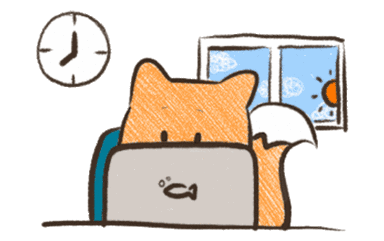
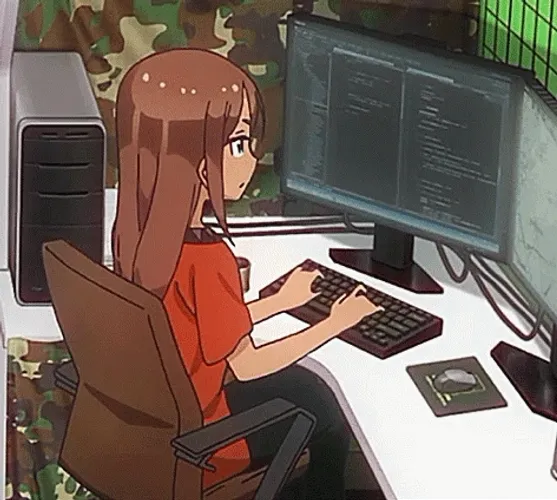
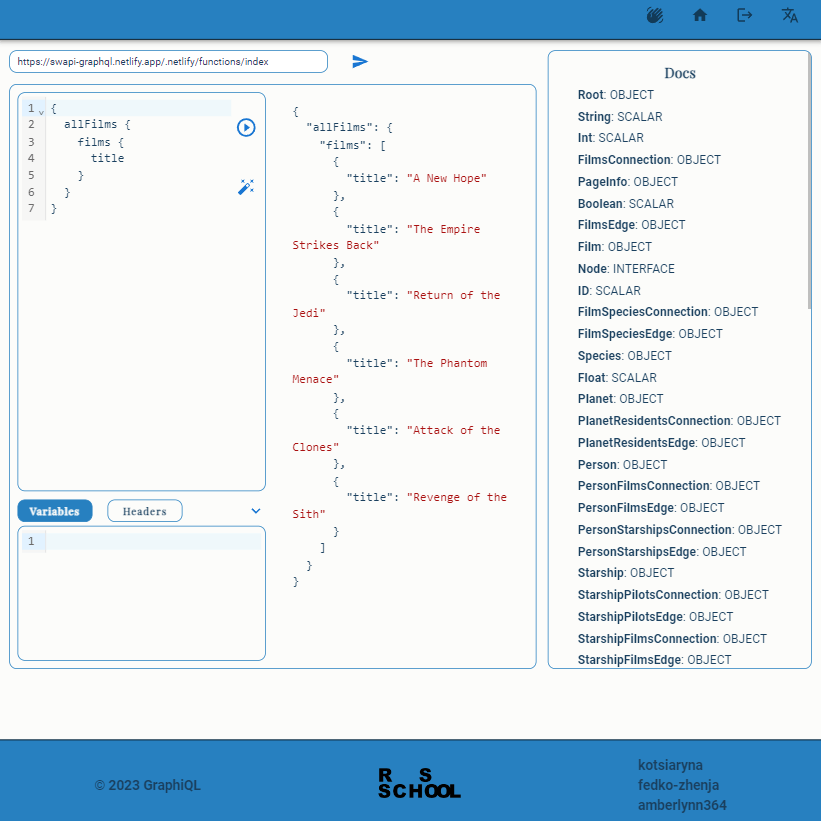

<h1 align="center">Hi there, I'm <b>Katsiaryna Talkachova</b> 
     
</h1>
<h2 align="center">Frontend Developer</h3>

 👩‍💻 1+ year in frontend developing
 
 📜 Lanading pages, js board games, e-commerce app in TS, SPAs and GraphQL playground/IDE in React
 
 🤝 Team player and have experience as a team-lead in a command of 3 
 
 🌎 Speak Russian (native), English (B2) 
 
  ⏳ Time-managment is my hobby and aim
  
 ✏️ Solving codewars in spare time
 
   

<h3>Languages: </h3>

  
  
  
  
  
  
  
 

<h3>Tools:</h3>

   
  
  
  
    
    
    

<h3> Contact me: </h3> 

 
 
  
  
 

 <h3> My projects: </h3> 

<h4> GraphQL IDE/Playground </h4>

 **Stack:** React/Redux, TS, SCSS, MUI, Jest 
 
A command project. Playground to send graphQL  requests to open APIs with (optionally) user's headers and variables. Registrationa and login/logout is implemented. Two languages - EN / RU. Error handling. Responsive design (min 320px). Test coverage 80%
 
<a href="https://github.com/kotsiaryna/graphiql-app">REPO </a>  &   <a href="https://react-rangers.netlify.app/">DEPLOY</a>

 
<h4> Board Games </h4>

 **Stack:** JS,CSS 
 Small board games in pure JS. Sound on/of, timer, best results, save, restart. 
 
<a href="https://github.com/kotsiaryna/GemPuzzle/tree/puzzle">GEM PUZZLE REPO </a>  &   <a href="https://kotsiaryna.github.io/GemPuzzle/puzzle/">DEPLOY</a>
<a href="https://github.com/kotsiaryna/GemPuzzle/tree/puzzle">Minesweeper REPO </a>  &   <a href="https://kotsiaryna.github.io/GemPuzzle/puzzle/">DEPLOY</a>
   

 
