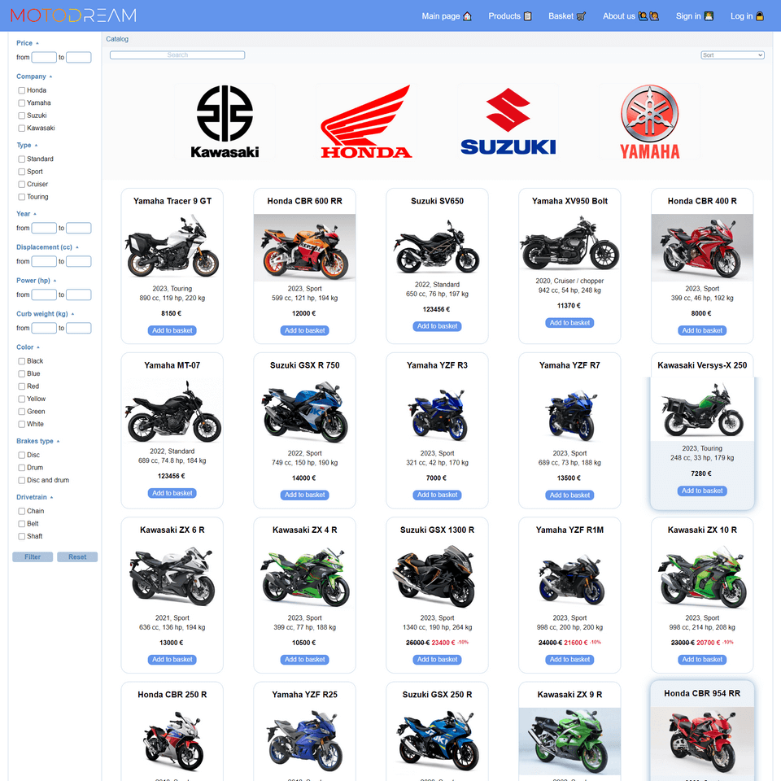
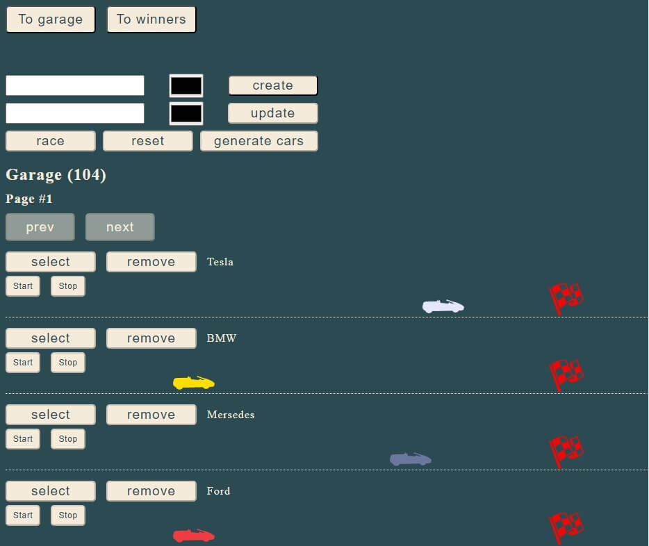
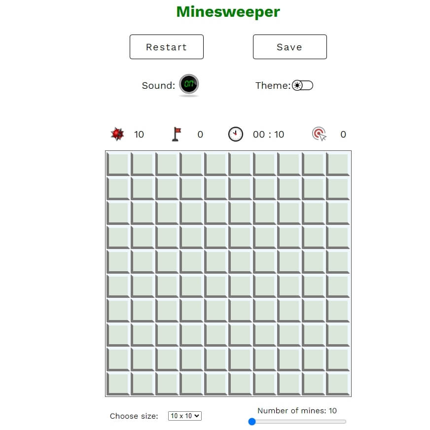
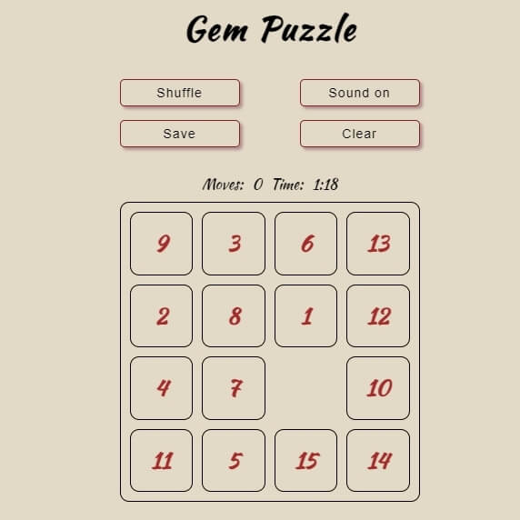

<h1 align="center">Hi there, I'm <b>Katsiaryna Talkachova</b> 
     
</h1>
<h2 align="center">Frontend Developer</h3>

 👩‍💻 1+ year in frontend developing
 
 📜 Lanading pages, js board games, e-commerce app in TS, SPAs and GraphQL playground/IDE in React
 
 🤝 Team player and have experience as a team-lead in a command of 3 
 
 🌎 Speak Russian (native), English (B2) 
 
  ⏳ Time-managment is my hobby and aim
  
 ✏️ Solving codewars in spare time
 
   

<h3>Languages: </h3>

  
  
  
  
  
  
  
 

<h3>Tools:</h3>

   
  
  
  
    
    
    

<h3> Contact me: </h3> 

 
 
  
  
 

 <h3> My projects: </h3> 

 <table>
   <tbody>
   <tr>
    <td width="30%">
     
    </td>
    <td>
  <h4> GraphQL IDE/Playground </h4>
      
  <i> Dec 2023- Jan 2024</i>
   
   **Stack:** React/Redux, TS, SCSS, MUI, Jest 

  A command project. Playground to send graphQL  requests to open APIs with (optionally) user's headers and variables. Registrationa and login/logout is implemented. Two languages - EN / RU. Error handling. Responsive design (min 320px). Test coverage 80%
  
  <a href="https://github.com/kotsiaryna/graphiql-app">REPO </a>  &   <a href="https://react-rangers.netlify.app/">DEPLOY</a>
  </td>
 </tr>
  <tr>
  <td width="30%"> 
  
  </td>
  <td>
 <h4>E-commerce SPA</h4>
    
 <i> Aug -Sept 2023</i>
    
 **Stack:** TS, SCSS, Jest, Webpack 
 
   A command project. E-commerce SPA, based on CommerceTools. Main features: Routing, Login & Registration, User profile, Catalog with sorting and filtering, Product detalization, Basket. Unit testing. 
 
  <a href="https://github.com/Greys73/eCommerce-Application">REPO </a>  &   <a href="">DEPLOY temporary n/a</a>
</td>
</tr>
 <tr>
   <td width="30%"> 
  
  </td>
 <td>
 <h4> Async Race </h4> 
   
 <i> July 2023</i>

  **Stack:** TS, SCSS, Webpack 
 
  Car racing with async requests to server with car data. Features: Create/update/remove car, start/stop single car race, start all cars race, winner table, pagination, random car generation.

  <a href="https://github.com/kotsiaryna/RSSchool_2023/tree/race"> REPO </a>  &   <a href="">DEPLOY - TODO!!!</a>
 </td>
 </tr>
  <tr>
  <td width="30%">  
   

  </td>
  <td>
<h4> Minesweeper </h4>
    
<i> May 2023</i>

  **Stack:** JS, SCSS, Webpack 
 
   Board game in pure JS. Sound on/of, timer, counter, results, save, restart, dark/light theme, options to chooze size and number of mines

  <a href="https://github.com/kotsiaryna/RSSchool_2023/tree/minesweeper"> REPO </a>  &   <a href="">DEPLOY - TODO!!!</a>
 </td>
</tr>
 <tr>
 <td width="30%"> 

 </td>
  <td>
 <h4> Gem Puzzles </h4>
    
 <i> Oct 2022</i>

  **Stack:** JS,CSS 

 Board game in pure JS. Sound on/of, timer, best results, save, restart. 
 
  <a href="https://github.com/kotsiaryna/GemPuzzle/tree/puzzle"> REPO </a> & <a href="https://kotsiaryna.github.io/GemPuzzle/puzzle/">DEPLOY</a>
</td>
 </tr>
</tbody>
</table>

 
